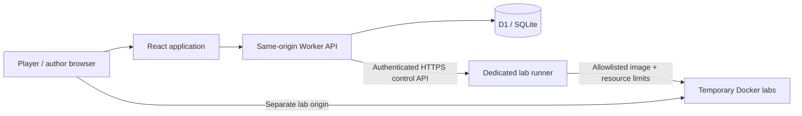

# Cipherground architecture

The platform is a React 19 + TypeScript application using the Vinext App Router, Vite 8, Tailwind 4 and accessible Base UI/Shadcn primitives. Its API runs as a Cloudflare Worker with the `nodejs_compat` flag. Cloudflare D1 supplies durable SQLite storage; Drizzle owns versioned schema migrations. Wrangler publishes the application Worker. Vulnerable labs run on a separate Docker host.

## Trust boundaries

- Browser state is a view of server records. No account, score or solve uses localStorage as authoritative storage.
- The application never runs submitted code, SQL, shell commands, Docker arguments or user-provided container images.
- The Docker daemon and its socket are absent from the platform Worker. The runner is a separate control service on an isolated host.
- Lab flags are HMAC-derived from the challenge ID and solo/team principal. Restarting an instance retains that principal’s flag. Players cannot claim other teams’ flags.
- Selected investigations produce a shared evidence-derived CORE plus a 12-hex token derived for the current solo/team principal. The server separately validates the CORE hash and token in constant time, so copying another principal’s completed flag fails.
- Downloadable challenge flags are SHA-256 hashes in organizer-only server source and D1. Flag matching is constant-time. Flags are high-entropy secrets or evidence-derived answers, not passwords.
- Session tokens and invite codes are 256-bit random values. Only their SHA-256 digests are persisted.

## Data model

Nine tables: `users`, `sessions`, `teams`, `challenges`, `solves`, `unlocks`, `submissions`, `limits`, `audit`.

Scores are derived from immutable solve-point snapshots minus one-time hint unlock costs. Unique indexes on `(principal, challenge_id)` prevent duplicate solve rewards and duplicate hint charges. A team is one scoring principal; solo players are separate principals. Ties use the earliest final solve, then principal ID for deterministic ordering. Leaderboards include principals with at least one solve, and return up to 100 entries.

Membership is fixed after the first solve or paid hint. SQL predicates and D1 batches protect membership and scoring from stale concurrent requests. Captains can rotate invite codes; teams have a maximum of five players. A new teammate shares a team’s previous progress, which is an explicit open-arena rule.

## Product routes

| Route             | Purpose                                                                  |
| ----------------- | ------------------------------------------------------------------------ |
| `/`               | Search, category, difficulty, and solve-status filters                   |
| `/challenges/:id` | Shareable challenge details, evidence, hints, flag form, lab launch      |
| `/labs/:slug`     | Same-origin hosted browser investigations and console/API puzzles        |
| `/leaderboard`    | Live persisted rankings, refreshed every 30 seconds                      |
| `/team`           | Create/join team, roster, captain invite rotation                        |
| `/submissions`    | Latest 100 attempts for the current principal                            |
| `/account`        | Registration, sign-in, profile, sign-out                                 |
| `/studio`         | Restricted challenge authoring, publishing, author roles, metrics, audit |
| `/guide`          | Competition rules, scoring, hints, scope                                 |

Authentication uses application-owned email/password accounts because the project specifically requires independent player registration. The public workers.dev site has no outer identity gate. Platform identity headers are not accepted as proof of an app administrator role.

## Challenge design

Nineteen examples span all six requested disciplines. Fourteen ship reproducible downloadable evidence, three are complete same-origin websites, and two can launch Docker-isolated vulnerability labs when a runner is connected. The hosted set covers a DevTools console investigation with a solo/team-specific flag, a five-view timeline case with a server-verified terminal, and a live three-request HTTP header reconstruction. Four long-form themed archives add nested ZIP evidence, clock normalization, hash chains, source validation, transposition cryptography, deliberate false flags and original PNG least-significant-bit payloads. Afterimage, Ravens of the Seven Realms and The Pensieve of the Missing Hour have prerequisite solves.

AI tools are allowed. These examples aim to reward genuine problem-solving, but do not guarantee resistance to capable automated solvers. The initial artifacts are compact educational fixtures, not full forensic disk images or production malware. This public repository includes `docs/SOLUTIONS.md` and answer-generation code, so the published examples cannot serve as secret scored competition content. Use fresh private challenges and rotate their answers for an event.

### Lab ingress

Each instance has an internal Docker network containing the vulnerable app and a fixed-upstream gateway. The app has no published ports. The gateway also joins its own ingress bridge and publishes a loopback port; it forwards only HTTP requests to that instance's app and holds no flag secret. The app is limited to 64 MB/0.5 CPU; its gateway to 32 MB/0.25 CPU. Both are non-root, read-only and capability-restricted. Container/network ownership labels scope cleanup to the runner. This follows Docker's internal-backend/front-end network pattern ([Docker networking documentation](https://docs.docker.com/engine/network/)). Public TLS routing and host firewall rules remain deployment responsibilities.
