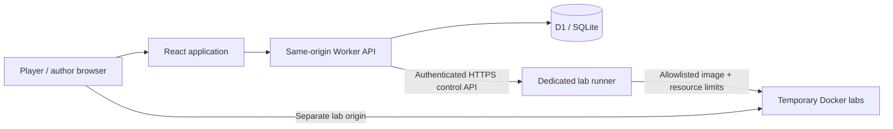

# Cipherground architecture

The platform is a React 19 + TypeScript application using the Vinext App Router, Vite 8, Tailwind 4 and accessible Base UI/Shadcn primitives. Its API runs as a Cloudflare Worker with the `nodejs_compat` flag. Cloudflare D1 supplies durable SQLite storage; Drizzle owns versioned schema migrations. Site hosting provisions the application Worker and database. Vulnerable labs run on a separate Docker host.

## Trust boundaries

- Browser state is a view of server records. No account, score or solve uses localStorage as authoritative storage.
- The application never runs submitted code, SQL, shell commands, Docker arguments or user-provided container images.
- The Docker daemon and its socket are absent from the platform Worker. The runner is a separate control service on an isolated host.
- Lab flags are HMAC-derived from the challenge ID and solo/team principal. Restarting an instance retains that principal’s flag. Players cannot claim other teams’ flags.
- Downloadable challenge flags are SHA-256 hashes in organizer-only server source and D1. Flag matching is constant-time. Flags are high-entropy secrets or evidence-derived answers, not passwords.
- Session tokens and invite codes are 256-bit random values. Only their SHA-256 digests are persisted.

## Data model

Nine tables: `users`, `sessions`, `teams`, `challenges`, `solves`, `unlocks`, `submissions`, `limits`, `audit`.

Scores are derived from immutable solve-point snapshots minus one-time hint unlock costs. Unique indexes on `(principal, challenge_id)` prevent duplicate solve rewards and duplicate hint charges. A team is one scoring principal; solo players are separate principals. Ties use the earliest final solve, then principal ID for deterministic ordering. Leaderboards include principals with at least one solve, and return up to 100 entries.

Membership is fixed after the first solve or paid hint. SQL predicates and D1 batches protect membership and scoring from stale concurrent requests. Captains can rotate invite codes; teams have a maximum of five players. A new teammate shares a team’s previous progress, which is an explicit open-arena rule.

## Product routes

| Route | Purpose |
| --- | --- |
| `/` | Search, category, difficulty, and solve-status filters |
| `/challenges/:id` | Shareable challenge details, evidence, hints, flag form, lab launch |
| `/leaderboard` | Live persisted rankings, refreshed every 30 seconds |
| `/team` | Create/join team, roster, captain invite rotation |
| `/submissions` | Latest 100 attempts for the current principal |
| `/account` | Registration, sign-in, profile, sign-out |
| `/studio` | Restricted challenge authoring, publishing, author roles, metrics, audit |
| `/guide` | Competition rules, scoring, hints, scope |

Authentication uses application-owned email/password accounts because the project specifically requires independent player registration. Sites also places its owner-only access gate around the private preview; passing that gate does not grant an application role. Platform identity headers are not accepted as proof of an app administrator role.

## Challenge design

Twelve examples span all six requested disciplines. Each has an organizer explanation and reproducible evidence. The two web labs require a vulnerability chain and use unique runtime flags. Afterimage depends on solving Packet Whisperer. Other investigations require reconstruction, clock normalization, modular arithmetic, state inversion, public-record cross-referencing, or resource-constrained scheduling.

AI tools are allowed. These examples aim to reward genuine problem-solving, but do not guarantee resistance to capable automated solvers. The initial artifacts are compact educational fixtures, not full forensic disk images or production malware. See `docs/SOLUTIONS.md` for intended answers; keep that file and this repository private during competition.
